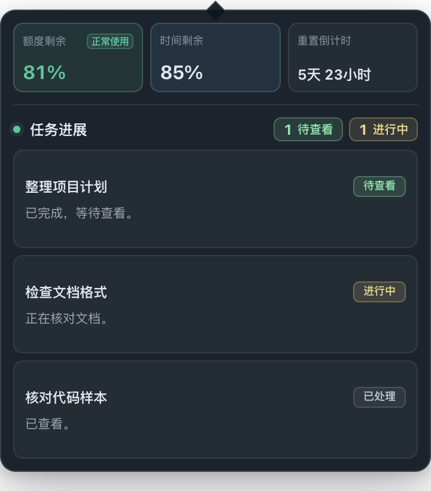
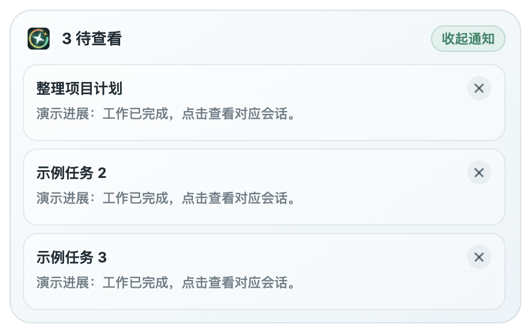
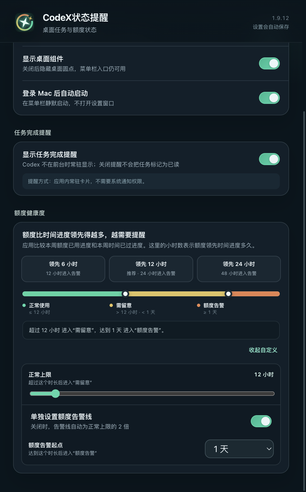
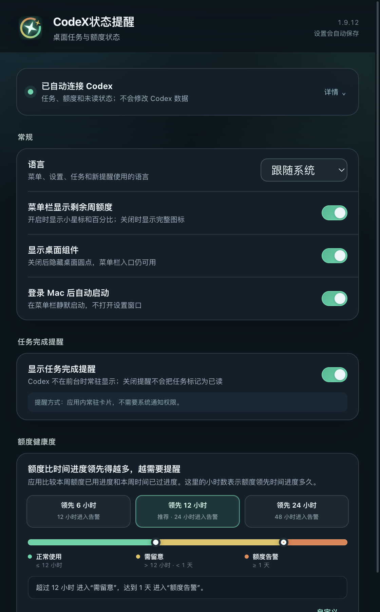

# 使用 CodeX状态提醒

## 开始使用

安装 Codex 并登录，然后将正式发行的 `CodeX状态提醒.app` 放进“应用程序”。从那里打开一次，应用会直接进入设置并自动连接，不需要先找 Codex 的安装目录，也不需要填写 API Key。

默认开启桌面组件、菜单栏额度数字、任务完成提醒和登录启动。设置自动保存，后续从菜单栏右键进入。应用运行时不出现在 Dock；如果你以前将它固定到 Dock，那是用户保留的快捷方式，需要通过 Dock 的“选项 → 从程序坞中移除”处理。

## 菜单栏和桌面圆点

图中数字为演示额度。以下图片来自候选应用的真实渲染页面，使用虚构任务与固定数据；不是你的账户或真实会话。

菜单栏左键展开／收起任务面板，右键显示配置菜单。鼠标停留在菜单栏图标上不弹出任务卡片。

“在菜单栏显示剩余额度”开启时，显示周额度剩余数字，左上角配小星芒；关闭时显示完整图标。没有可用额度时不会冒充为 0%。

桌面圆点是同一份数据的另一入口。悬停展开任务，点击打开 Codex；拖动圆点时卡片跟随，位置会保存。组件始终高于普通窗口，默认跨桌面空间显示，在全屏应用内隐藏。没有另外的置顶、多空间或移动到当前屏幕配置。

## 任务面板

上方三张卡片依次显示周额度剩余、周期时间剩余和重置倒计时。“时间剩余”和倒计时使用白色文字；额度颜色表达健康度。

下方为任务列表。排序为待查看、进行中、已处理，同一状态优先最近活动。标题区只显示待查看和进行中的数量；任务视窗默认展示三行，其余可滚动，滚动条不常驻显示。圆点中心优先显示待查看任务数，没有待查看时显示剩余额度整数，不加百分号。

| 状态 | 含义 | 样式 |
| --- | --- | --- |
| 待查看 | 任务已经停止，最新内容在 Codex 中仍未读 | 绿色 |
| 进行中 | Codex 表明任务仍在运行，或尚未获取到明确终止状态且当前轮次未结束 | 浅黄色 |
| 已处理 | 任务已停止，最新内容已被查看 | 灰色 |

等待审批或等待回答可能仍属于活动任务，不意味着 CPU 一直工作。如果明确暂停、中止、取消、失败或结束，将移出“进行中”，再按实际未读状态归入待查看或已处理。运行状态暂不可读时，兼容层可能短暂保留旧判断，不能把本地记录当作绝对实时的权威状态。

点击任务打开对应 Codex 会话。应用不通过改写数据库来把会话标为已读；是否已读由 Codex 客户端决定。

如果未读状态暂时取不到，停止的任务显示“待同步”，待查看数量显示“–”；这表示软件还不知道是否已查看，不会把它当成“已处理”或零条未读。连接恢复后自动更新，不需要修改 Codex 数据。

## 任务完成提醒

默认在 Codex 不在前台、任务新一轮完成且未读时显示提醒。完成以 Codex 的任务完成事件为依据，不把取消或中止当作成功完成。标题直接使用会话名称，图标放在标题行，不占任务详情的宽度。

多条提醒采用分组堆叠，最新完成的在前；展开后可逐条查看。提醒不会因固定计时自动消失。点击提醒会立即撤下这一条，并请求 Codex 打开对应会话；直接从 Codex 查看会话，则在已读状态同步后撤下提醒。关闭按钮也只移除这一条，不清掉 Codex 的未读状态；同一轮完成不会不断弹出。

点击提醒不等于已经读完。若会话跳转失败，这条提醒仍已撤下，任务可以继续出现在“待查看”列表；可从任务面板再次打开。

这是应用自绘的常驻提醒，不是 macOS 通知中心横幅。系统可能用原生通知作为异常回退，但原生通知的停留时间和按钮由系统控制，不能保证与常驻卡片完全相同。关闭提醒开关后不再显示；开启时不会把所有历史未读任务重新轰炸一遍。

1.9.14 在漏发修复基础上补齐故障恢复：前台或未读状态暂时读不到时等待下次正常同步；已显示的提醒缓存标题和摘要，重启暂缺数据时也能恢复。未读数据已成功读取但标记尚未出现时，最多等待 10 分钟对齐；明确仍未读的任务不会仅因等待超时被丢弃。通知窗口异常会有限重建，不反复重启整个软件。重新开启提醒不补发关闭期间的消息，也不把稍后才发现的历史任务当作新消息。

提醒不是无限消息存档：最多保留最近 100 条待查看提醒和 100 条待判断记录。关闭、查看或关闭提醒开关后，会按相应规则清理。磁盘不可写且进程退出时，尚未保存的提醒不能保证恢复。

## 额度健康度

软件把“已经使用的额度”与“已经过去的周期时间”换算成同一条时间线。超前 12 小时，表示额度比按时间均匀使用的节奏多消耗了半天；不是必须到晚上才触发。

默认规则：

- 超前不超过 12 小时：正常使用，绿色。
- 超过 12 小时但不到 24 小时：需留意，黄色。
- 超前达到 24 小时：额度告警，橙色。

选择提前、标准或延后提醒时，先调整正常使用的上限，告警线默认是该上限的两倍。例如 6 小时对应 12 小时告警，24 小时对应 48 小时告警。正常上限设为 0 小时时，告警线仍为 6 小时，避免两个节点重叠。需要不同距离时再启用自定义告警线。两个圆点把时间条分成绿、黄、橙三个区间，不需要分别配置三种状态。

这只改变提醒的时间，不增加额度、不影响 Codex 计费，也不预测下一次请求一定够用。额度或周期缺失时显示待同步，不做错误的健康判断。

## 连接和常规设置

- 语言：跟随系统、简体中文或 English。
- 登录启动：登录 Mac 后静默启动，不自动弹出设置页；系统可能要求允许登录项。
- 显示桌面组件：关闭圆点后，菜单栏入口仍然存在。
- 菜单栏额度：切换数字与完整图标。
- 任务完成提醒：控制常驻提醒。
- 额度健康度：选择使用节奏，并可自定义告警线。

连接正常时无需操作。应用检查标准目录、有效的已连接位置和可发现的 Codex 程序；多次发现失败后才显示手动选择数据文件夹的入口。这里选择的是 Codex **数据目录**，不是一定要选 Codex.app 所在文件夹。

## 常见问题

**菜单栏没有图标**：先确认只有一份应用在运行，已安装在“应用程序”。检查系统菜单栏显示开关和第三方菜单栏管理工具。正常显示不要求辅助功能或屏幕录制权限。若仍不可见，提供脱敏截图和版本信息；不要还原整个控制中心或执行网上的私有偏好修改命令。

**额度、时间显示待同步**：确认 Codex 已登录且该账户有可读的周期额度。网络、服务错误、API Key／第三方模型或 Codex 协议变化都可能影响显示。不要为了排查上传 auth.json。

**任务计数与 Codex 不同**：先比较同一时刻的顶层本地会话；子任务、已归档／远程会话和版本兼容性可能影响范围。明确停止的任务不应继续算进行中；请报告复现，不要手动改数据库。

**提示无法验证开发者**：正式包应通过 Developer ID 和公证。检查下载来源、版本和校验值，报告问题，不关闭系统安全机制。如果你选择源码开发构建，它与正式签名发行的安装体验不同。

## 更新与卸载

本版本没有自动更新器；从正式 Releases 下载新版本，正常退出应用后替换“应用程序”中的同名应用。只保留一份，不同时从下载目录、挂载镜像和应用程序运行不同副本。

卸载时先关闭“登录启动”，从菜单栏退出，再将“应用程序”中的本应用移到废纸篓。要清除配置，可另行移除 `~/Library/Application Support/codex-companion` 和 Electron 的应用自身缓存。不要删除 `~/.codex`，那是 Codex 的会话与账号数据。macOS 保留的历史菜单栏记录由系统管理，本应用不提供修改其私有数据库的卸载脚本。
